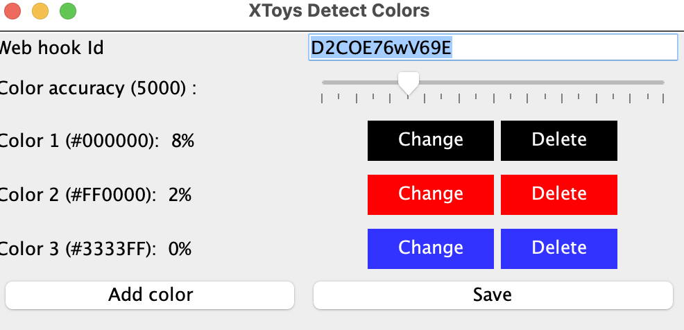

# xtoys-color-detector

# Requirements: 

You'll need to install java 17 on your operating system.
https://www.oracle.com/java/technologies/javase/jdk17-archive-downloads.html

# Usage:
Download the code via 'Code' -> 'Download zip'.
Extract the zip somewhere convenient for yourself.

Start the application with java in the command line:
java XToysDetectColors.java

It will launch a UI.
Make sure you enter your xtoys webhook id and add some colors.
